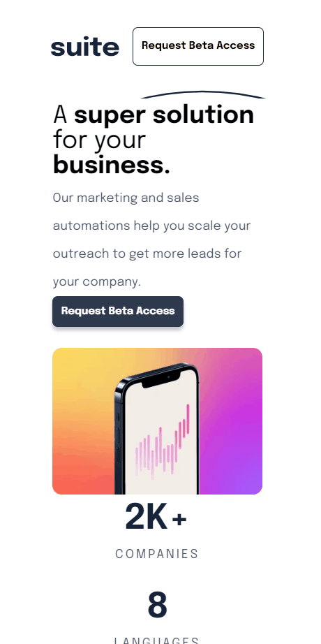

    <h1>Suite page</h1>

Neste projeto pude exercitar minhas habilidades com ReactJS e Styled-components

---
 

# Features 🪐

- [x] Esse projeto representa o sistema de uma empresa que oferece serviços na área de marketing.  
- [x] O projeto é responsivo a fim de entregar uma melhor experiência de usuário a quem acessa o site por meio de dispositivos móveis.  

---

# Tecnologias utilizadas

- [x] Javascript
- [x] ReactJs
- [x] Styled-components

 

# Demo Desktop 📷

<h1 align = "center">
    
</h1>

# Demo Tablet 📷

<h1 align = "center">
    
</h1>

# Demo Smartphone 📷

<h1 align = "center">
    
</h1>

 

# Feito com ❤️ por Fabio Del Col Matiusso